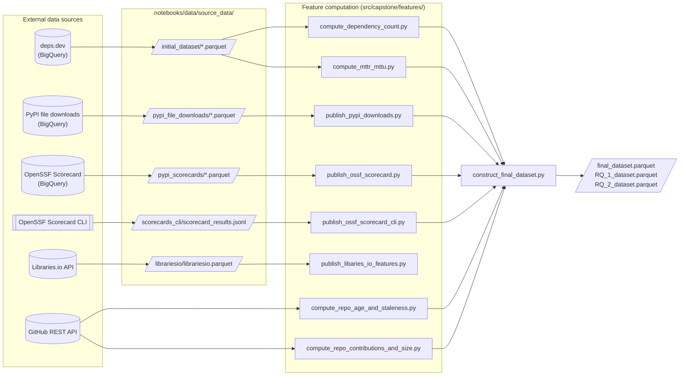

# The Effects of Security Best Practices on Security Outcome Metrics in the Python Ecosystem 

By [Cyril Scerbin](mailto:kshcherb@umich.edu), [Jason Harris](mailto:harjason@umich.edu), [Emily Lerner](mailto:eslerner@umich.edu) </br>
Supervised by [Dr. Paul Resnick](mailto:presnick@umich.edu)

This study was conducted in connection with MADS SIADS 699, the Capstone Project course, in partial fulfillment of the requirements for the Master of Applied Data Science degree at the University of Michigan.

It builds on prior research by Nusrat Zahan, Imranur Rahman, and Laurie Williams, ["Assumptions to Evidence: Evaluating Security Practices Adoption and Their Impact on Outcomes in the npm Ecosystem."](https://arxiv.org/abs/2504.14026) While the original study focuses on the npm ecosystem, our work adapts and extends its methodology to the Python ecosystem to examine whether similar relationships between security practice adoption and security outcomes hold. By applying comparable metrics and analytical approaches in a different ecosystem, this study aims to validate, generalize, and expand upon the findings of the original research.

-----
<details>
<summary><h1 style="display: inline;">Prerequisites</h1></summary>

Before completing `Local Development Setup`, ensure your machine meets the following software requirements:

### Required Software
* **[Docker Desktop](https://www.docker.com/products/docker-desktop)**: Required to host the development containers.
    * *Windows Users:* Ensure **WSL2** is installed and updated.
* **[Visual Studio Code](https://code.visualstudio.com/)**: The recommended IDE for this project.
* **[Dev Containers Extension](https://marketplace.visualstudio.com/items?itemName=ms-vscode-remote.remote-containers)**: Allows VS Code to open the project inside the Docker environment.

### Recommended Tools
* **[direnv](https://direnv.net/)**: For automatic loading of environment variables from your `.env` file.
* **[Git](https://git-scm.com/)**: To clone and manage project versions.

### Recommended Hardware Minimums

| Component | Minimum Requirement | Recommended (for 60GB WSL config) |
| :--- | :--- | :--- |
| **Processor (CPU)** | 8 Cores (Intel i7 / Ryzen 7 / Apple M2) | 16 Cores (Intel i9 / Ryzen 9 / Apple Max) |
| **Memory (RAM)** | 32 GB | 64 GB |
| **Storage** | 50 GB Free SSD Space | 200 GB Free SSD Space |
| **OS** | Windows 11 (WSL2) / macOS / Linux | Linux (Ubuntu) or Windows 11 (WSL2) |
| **Virtualization** | BIOS Virtualization Enabled | BIOS Virtualization Enabled |
</details>

<details>
<summary><h1 style="display: inline;">Local Development Setup and Run</h1></summary>

Before following this setup, please see the `Prerequisites` section.

## Clone the Repository
First, fetch the project from GitHub:
```sh
git clone https://github.com/shcherbin/mads-siads-699-winter-2026-capstone.git
```

## Configuration
All configuraion parameters are stored in the `.env` file. 
Once the repo is cloned copy the `.env.example` and made the necessary changes.

```sh
cp .env.example .env
```

to access configration parameters in python use the following code snippet. 

```python
from birds.settings import load_settings

settings = load_settings()

print(settings.env)
print(settings.version)
```

## Accessing .env in the Terminal
Enable automatic environment variable loading with direnv:
```sh
direnv allow
```
Run this once per shell. If .env changes, you’ll be prompted to re-run the command.

Note: If you are using a windows pc and WSL, you may need to run the following for the direnv file to be valid:
```
sudo apt install dos2unix
dos2unix .envrc
```
If using windows, you may also want to do the following to ensure consistent spacing in proceeding pr's:
```
git config --global core.autocrlf input
```


## Start the Development Environment
With Docker Desktop running, open the repository in VS Code. You should see a prompt to “Reopen in Container”.
Alternatively, use the Command Palette (Ctrl+Shift+P / Cmd+Shift+P) and select:
```
Dev Containers: Reopen in Container
```
This builds and runs the project’s development container, installing all dependencies inside an isolated environment.

For additional information, see [Official Dev Container Guide](https://code.visualstudio.com/docs/devcontainers/containers).

## How to run code
Once you can have verified that you are running in a dev container based on the above steps, you should be able to run notebooks by clicking on the `Run All` button at the top of VS Code. Similarly, the `Run` button should work for python scripts. The scripts and notebooks have been verified by our development team, so if you are running into an error, it is most likely an environment issue. See the `Common Issues (Check this if your code will not run)` section for potential resolutions, and verify that you have successfully setup the environment above. 

</details>

<details>
<summary><h1 style="display: inline;">Data Pipeline</h1></summary>

NOTE: Only the final data necessary for notebooks rq1.ipynb and rq2.ipynb is included in this repo.  If access to additional raw data collected is desired, please contact harjason@umich.edu for access credentials.

This section describes where the datasets in this project come from, how they
flow through the pipeline, and which scripts and `just` recipes produce each
artifact. It is intentionally a high-level map — it does **not** define
individual fields or metrics.


## Overview

The project combines dependency-graph, popularity, security, and repository
metadata for a curated set of PyPI packages. The pipeline has four stages:

1. **BigQuery dataset construction** — SQL queries against public BigQuery
   datasets produce the initial package/dependency snapshot and some control
   variables. Results are exported as parquet to Google Cloud Storage and then
   synced down to `notebooks/data/source_data/`.
2. **API extraction** — Python scripts call the GitHub and Libraries.io REST
   APIs to gather repository metadata not available in BigQuery.
3. **Feature computation** — Python scripts transform the source data into
   per-package feature files under `notebooks/data/augmented_data/features/`.
4. **Final assembly** — A single merge step joins every feature file into the
   analysis-ready datasets used by the RQ notebooks.

Source parquet files are transported between team members via S3 using the
`download-source-data` / `upload-source-data` recipes in the [justfile](justfile).

## Pipeline diagram



## Data sources

### 1. deps.dev (Google BigQuery)

- **What it is:** Google's open-source dependency graph. We use the PyPI
  ecosystem tables to identify packages, their versions, their GitHub repo
  mappings, and their direct/transitive dependencies.
- **BigQuery dataset:** `bigquery-public-data.deps_dev_v1.*`
  (`PackageVersions`, `PackageVersionToProject`, `Dependencies`, `Dependents`,
  `Projects`)
- **Reference:** <https://deps.dev/> · <https://docs.deps.dev/bigquery/v1/>
- **Queries:** [sql/dataset_construction/initial_dataset/](sql/dataset_construction/initial_dataset/)
  - `1_unique_packages.sql` → `5_single_package_repos.sql` — progressive
    filters that narrow PyPI down to packages with GitHub repos, declared
    dependencies, dependents, and a single-package-per-repo layout.
  - `final_dataset.sql` — exports the curated package/dependency snapshot to
    `gs://pypi_deps/initial_dataset/*.parquet`.

### 2. PyPI file downloads (Google BigQuery)

- **What it is:** Download counts per PyPI package version, used as a
  popularity control variable.
- **BigQuery dataset:** `bigquery-public-data.pypi.file_downloads`
- **Reference:** <https://docs.pypi.org/api/bigquery/>
- **Query:** [sql/dataset_construction/control_variable_metrics/total_downloads.sql](sql/dataset_construction/control_variable_metrics/total_downloads.sql)
  — exports the last 12 months of downloads to
  `gs://pypi_deps/pypi_file_downloads/*.parquet`.
- **Feature publisher:** [src/capstone/features/publish_pypi_downloads.py](src/capstone/features/publish_pypi_downloads.py)
  (`just publish-feature-pypi-downloads`).

### 3. OpenSSF Scorecard (Google BigQuery)

- **What it is:** Automated security-practice scores for open source
  repositories, published by the OpenSSF as a weekly cron.
- **BigQuery dataset:** `openssf.scorecardcron.scorecard-v2`
- **Reference:** <https://github.com/ossf/scorecard> ·
  <https://securityscorecards.dev/>
- **Query:** [sql/dataset_construction/open_ssf_scorecard/scorecard_metrics.sql](sql/dataset_construction/open_ssf_scorecard/scorecard_metrics.sql)
  — joins the scorecard table against our curated repo list (uploaded to
  BigQuery from `notebooks/data/augmented_data/unique_packages.parquet`).
- **Feature publisher:** [src/capstone/features/publish_ossf_scorecard.py](src/capstone/features/publish_ossf_scorecard.py)
  (`just publish-feature-ossf-scorecard`).

### 4. OpenSSF Scorecard CLI (supplemental)

- **What it is:** Locally generated scorecard runs for repositories not
  covered by the OpenSSF's hosted cron. Output is appended to the BigQuery
  scorecard data so coverage is complete.
- **Reference:** <https://github.com/ossf/scorecard#using-the-command-line>
- **Input:** `notebooks/data/source_data/scorecards_cli/scorecard_results.jsonl`
  (produced by manual CLI runs outside this repo).
- **Feature publisher:** [src/capstone/features/publish_ossf_scorecard_cli.py](src/capstone/features/publish_ossf_scorecard_cli.py)
  (`just publish-feature-ossf-scorecard-cli`).

### 5. GitHub REST API

- **What it is:** Repository-level metadata used for temporal and activity
  control variables (age, staleness, contributor count, size on disk).
- **Access:** PyGithub client, authenticated with `GITHUB_TOKEN`.
- **Reference:** <https://docs.github.com/en/rest>
- **Scripts:**
  - [src/capstone/features/compute_repo_age_and_staleness.py](src/capstone/features/compute_repo_age_and_staleness.py)
    (`just compute-feature-repo-age-and-staleness`)
  - [src/capstone/features/compute_repo_contributions_and_size.py](src/capstone/features/compute_repo_contributions_and_size.py)
    (`just compute-feature-repo-contributors-and-size`)

### 6. Libraries.io API

- **What it is:** Aggregated package and repository metadata. Currently
  extracted for exploratory use; the Libraries.io feature join is disabled in
  final assembly in favor of direct GitHub API data.
- **Access:** HTTP calls to `https://libraries.io/api/github/{owner}/{repo}`,
  authenticated with `LIBRARIESIO_API_KEY`, rate-limited to 1 req/sec.
- **Reference:** <https://libraries.io/api>
- **Extractor:** [src/capstone/extraction/extract_librariesio_api.py](src/capstone/extraction/extract_librariesio_api.py)
- **Feature publisher:** [src/capstone/features/publish_libaries_io_features.py](src/capstone/features/publish_libaries_io_features.py)
  (`just publish-feature-libraries-io`)

### 7. Derived: MTTU / MTTR

- **What it is:** Mean-time-to-update and mean-time-to-remediate metrics
  derived from the deps.dev snapshot and PyPI release timelines. This is not
  a separate upstream source — it is a derived feature computed from the
  `initial_dataset` parquet files using the `dependency_metrics` helper
  library.
- **Script:** [src/capstone/features/compute_mttr_mttu.py](src/capstone/features/compute_mttr_mttu.py)
  (no `just` recipe; run directly — this is a long-running job with
  checkpointing).
- **Based on:** https://github.com/imranur-rahman/dependency-update-metrics

## Pipeline stages

### Stage 1 — BigQuery construction

Run the SQL files in [sql/dataset_construction/](sql/dataset_construction/)
directly in the BigQuery console. The `final_dataset.sql` and
`total_downloads.sql` queries write parquet files to
`gs://pypi_deps/...`; download them into `notebooks/data/source_data/` (either
manually from GCS or via the team S3 mirror — see stage 0 below).

### Stage 0 — Source data transport

- `just download-source-data` — syncs `notebooks/data/` down from the team's
  S3 bucket (`AWS_S3_BUCKET` env var).
- `just upload-source-data` — uploads local `notebooks/data/` back to S3
  after a dry-run confirmation.

### Stage 2 — API extraction

Run before feature computation so downstream scripts can read the resulting
parquet files:

```
python ./src/capstone/extraction/extract_repo_list.py
python ./src/capstone/extraction/extract_librariesio_api.py
```

### Stage 3 — Feature computation

Each recipe writes a feature parquet under
`notebooks/data/augmented_data/features/`:

```
just compute-feature-dependency-count
just compute-feature-repo-age-and-staleness
just compute-feature-repo-contributors-and-size
just publish-feature-pypi-downloads
just publish-feature-ossf-scorecard
just publish-feature-ossf-scorecard-cli
just publish-feature-libraries-io
python ./src/capstone/features/compute_mttr_mttu.py
```

### Stage 4 — Final assembly

```
just construct-final-dataset
```

This produces the analysis-ready files consumed by the RQ notebooks:

- `notebooks/data/augmented_data/final_dataset.parquet`
- `notebooks/data/augmented_data/RQ_1_dataset.parquet`
- `notebooks/data/augmented_data/RQ_2_dataset.parquet`

## Reproducing the pipeline end-to-end

For a fresh environment with access to the team S3 bucket:

```
just install-python-dependencies
just download-source-data

# (Re-run BigQuery SQL only if source data needs refresh, then re-download.)

python ./src/capstone/extraction/extract_repo_list.py
python ./src/capstone/extraction/extract_librariesio_api.py

just compute-feature-dependency-count
just compute-feature-repo-age-and-staleness
just compute-feature-repo-contributors-and-size
just publish-feature-pypi-downloads
just publish-feature-ossf-scorecard
just publish-feature-ossf-scorecard-cli
just publish-feature-libraries-io
python ./src/capstone/features/compute_mttr_mttu.py

just construct-final-dataset
```

</details>

<details>

<summary><h1 style="display: inline;">Common Issues (Check this if your code will not run)</h1></summary>

## Adjusting Docker Desktop Resource Limits

If your project is crashing with `Out of Memory` (OOM) errors, you may need to manually increase the RAM and CPU allocated to Docker.

### For macOS and Linux
1. Open **Docker Desktop**.
2. Click the **Settings** (gear icon) in the top-right corner.
3. Select **Resources** from the left-hand sidebar.
4. Under **Advanced**, use the sliders to adjust:
   - **CPUs**: Set to at least 8 (or half your total cores).
   - **Memory**: Increase to **60GB** (if your hardware allows).
5. Click **Apply & Restart**.

### For Windows (WSL2 Backend)
In the modern WSL2 mode, Docker Desktop does not use sliders. Instead, it "borrows" memory from the global WSL2 utility VM.

1. **Check if sliders are missing:** Go to `Settings > Resources`. If you see a message saying *"You are using the WSL 2 backend"*, the sliders will be hidden.
2. **The Fix:** You must use the `.wslconfig` method:
   - Press `Win + R`, type `%UserProfile%`, and press Enter.
   - Edit (or create) the `.wslconfig` file.
   - Add/Update these lines:
     ```ini
     [wsl2]
     memory=60GB
     processors=16
     ```
3. **Restart:** You **must** run `wsl --shutdown` in PowerShell for these changes to take effect.

> [!TIP]
> **Pro-Tip for Mac (Apple Silicon):** Ensure **"Use Virtualization framework"** and **"VirtioFS"** are enabled under `Settings > General` and `Resources > File Sharing` for a 10x boost in file-reading speed within your notebooks.

</details>
